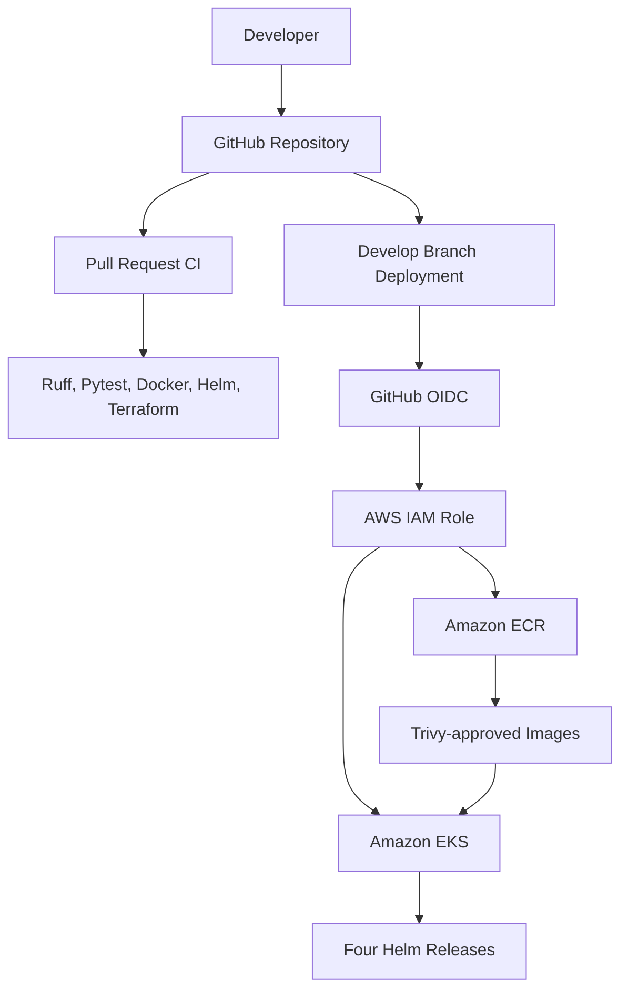
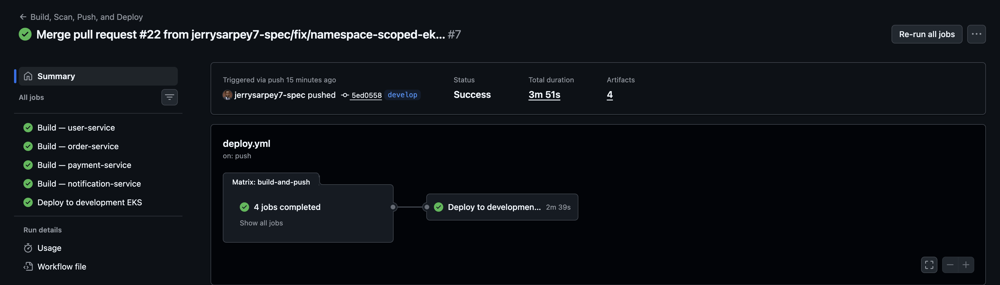
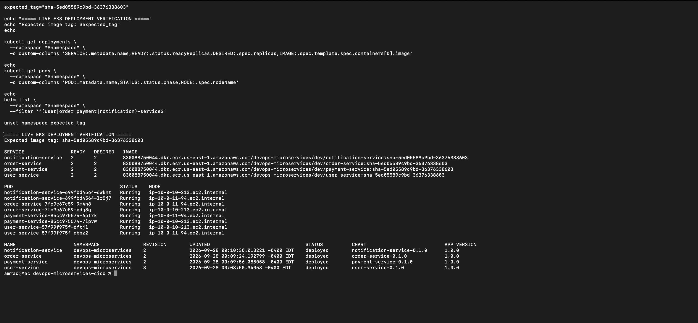

# Microservices Kubernetes CI/CD Platform

A production-style DevSecOps portfolio project that builds, scans, publishes, and deploys four Python FastAPI microservices to Amazon EKS.

The platform uses Terraform for AWS infrastructure, Helm for Kubernetes packaging, GitHub Actions for CI/CD, GitHub OIDC for keyless AWS authentication, and Trivy and Checkov for security enforcement.

## Architecture



## Microservices

| Service | Local port | Purpose |
|---|---:|---|
| User Service | 8001 | User registration and retrieval |
| Order Service | 8002 | Order creation and status management |
| Payment Service | 8003 | Payment processing |
| Notification Service | 8004 | Application notification handling |

Each service includes:

- FastAPI application code
- Automated Pytest tests
- Ruff linting
- Multi-stage Docker image
- Non-root container execution
- Kubernetes readiness and liveness probes
- Dedicated Helm chart

## Implemented Platform

### Application and Containers

- Four independently containerized FastAPI services
- Docker Compose development environment
- Read-only container filesystems
- Dropped Linux capabilities
- `no-new-privileges` security control
- Health and functional smoke testing
- Trivy vulnerability and secret scanning

### AWS Infrastructure

Terraform provisions and manages:

- Multi-AZ VPC
- Two public subnets
- Two private subnets
- Internet Gateway
- NAT Gateway
- Private route tables
- S3 Gateway Endpoint
- Four private ECR repositories
- IAM roles for EKS
- Amazon EKS cluster
- Two-node managed node group
- KMS encryption
- EKS control-plane logging
- GitHub Actions OIDC provider and deployment role
- Namespace-scoped EKS access for GitHub Actions

Terraform state is stored remotely in an encrypted Amazon S3 backend.

### Amazon EKS

The development platform uses:

- Kubernetes 1.36
- Private worker subnets
- Two `t3.small` managed nodes
- `ON_DEMAND` capacity
- Public API access restricted to an approved `/32` CIDR
- Private API endpoint access
- Five EKS control-plane log types
- 365-day CloudWatch log retention
- KMS encryption for Kubernetes secrets
- EKS Pod Identity Agent
- CoreDNS, kube-proxy, and VPC CNI add-ons
- IAM OIDC provider for Kubernetes workloads

### Helm Delivery

Each microservice has an independent Helm chart containing:

- Deployment
- ClusterIP Service
- ServiceAccount
- PodDisruptionBudget
- Readiness and liveness probes
- Resource requests and limits
- Security context
- Helm connection test

Deployments use:

```bash
helm upgrade --install \
  --atomic \
  --wait \
  --timeout 10m
```

The `--atomic` option automatically restores the previous release if an upgrade fails.

## CI/CD Workflows

### Pull Request CI

`.github/workflows/ci.yml` runs against pull requests targeting `develop`.

The workflow performs:

1. Ruff linting for all four services
2. Pytest execution for all four services
3. `linux/amd64` container builds
4. Helm linting and template rendering
5. Terraform formatting and validation
6. TFLint analysis
7. Checkov infrastructure security scanning

### Build, Scan, Push and Deploy

`.github/workflows/deploy.yml` runs after changes reach `develop`.

The workflow:

1. Generates an immutable image tag from the commit SHA and workflow run ID
2. Obtains short-lived AWS credentials through GitHub OIDC
3. Builds all four container images
4. Blocks HIGH and CRITICAL Trivy findings
5. Pushes verified images to Amazon ECR
6. Authenticates to Amazon EKS
7. Verifies namespace-scoped Kubernetes authorization
8. Deploys all four Helm releases
9. Verifies Kubernetes rollout completion
10. Runs Helm tests

No long-lived AWS access keys are stored in GitHub.

## Security Controls

| Layer | Controls |
|---|---|
| Source | Pull-request workflow and validation gates |
| Application | Ruff and Pytest |
| Container | Non-root user, read-only filesystem, dropped capabilities |
| Image | Trivy HIGH/CRITICAL blocking gate |
| Registry | Immutable ECR tags, scan on push, KMS encryption |
| Terraform | Formatting, validation, TFLint and Checkov |
| AWS access | Short-lived GitHub OIDC credentials |
| EKS | Private nodes, restricted API CIDR, KMS encryption and logging |
| Deployment | Namespace-scoped access, Helm atomic rollout and tests |

## Repository Structure

```text
.
├── .github/workflows/
│   ├── ci.yml
│   └── deploy.yml
├── deploy/helm/
│   ├── notification-service/
│   ├── order-service/
│   ├── payment-service/
│   └── user-service/
├── docs/screenshots/
├── infra/terraform/
│   ├── bootstrap/
│   ├── environments/dev/
│   └── modules/
│       ├── ecr/
│       ├── eks/
│       ├── github-actions/
│       ├── iam/
│       └── vpc/
├── services/
│   ├── notification-service/
│   ├── order-service/
│   ├── payment-service/
│   └── user-service/
└── docker-compose.yml
```

## Local Development

### Requirements

- Docker Desktop
- Docker Compose
- Python 3.12
- Git

Start all four services:

```bash
docker compose up --build -d
```

Check their status:

```bash
docker compose ps
```

Access the API documentation:

| Service | Swagger UI |
|---|---|
| User Service | http://localhost:8001/docs |
| Order Service | http://localhost:8002/docs |
| Payment Service | http://localhost:8003/docs |
| Notification Service | http://localhost:8004/docs |

Stop the environment:

```bash
docker compose down
```

## Terraform Validation

Initialize the development environment with the local backend configuration:

```bash
terraform \
  -chdir=infra/terraform/environments/dev \
  init \
  -reconfigure \
  -backend-config=backend.hcl
```

Validate the configuration:

```bash
terraform fmt -check -recursive infra/terraform

terraform \
  -chdir=infra/terraform/environments/dev \
  validate
```

Actual backend and variable files are intentionally excluded from Git. Use the committed `.example` files as templates.

## Deployment Evidence

### Successful CI/CD Workflow



### Live Amazon EKS Verification



Additional implementation evidence is available under [`docs/screenshots`](docs/screenshots).

## Verified Outcome

The completed workflow successfully:

- Built four `linux/amd64` images
- Passed four Trivy security scans
- Published four immutable images to Amazon ECR
- Assumed the AWS deployment role through GitHub OIDC
- Deployed four Helm releases to Amazon EKS
- Completed all Kubernetes rollouts
- Passed all Helm tests

## Cost Notice

This project creates billable AWS resources, including an EKS control plane, EC2 worker nodes and a NAT Gateway. Destroy unused development resources when they are no longer required.

## Future Improvements

The following are roadmap items and are not represented as completed features:

- Prometheus and Grafana observability
- Centralized application logging
- Ingress controller and TLS
- Service mesh implementation
- Database persistence
- Deployment notifications
- Production and staging environments
- Automated dependency updates

## Author

**Jerry Sarpey**

- GitHub: [github.com/jerrysarpey7-spec](https://github.com/jerrysarpey7-spec)
- LinkedIn: [linkedin.com/in/jerrysarpey](https://www.linkedin.com/in/jerrysarpey/)